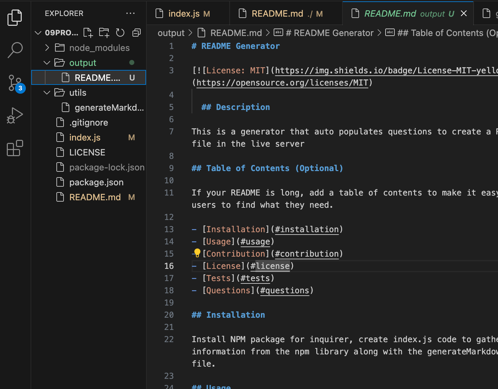

# 09Professional-README-Generator

## Description

In this assignment I learned how to create a code to generate a README file once answered the questions that appeared in the intergrated terminal.

## Table of Contents

- [Installation](#installation)
- [Usage](#usage)
- [License](#license)

## Installation

What are the steps required to install your project? Provide a step-by-step description of how to get the development environment running.

## License

## Usage

